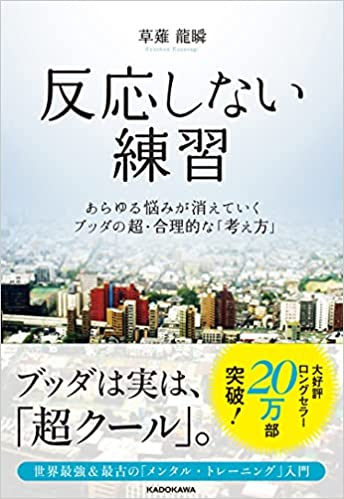

<!DOCTYPE html>
<html lang="ja">
  <head>
    <meta charset="utf-8">
    <title>My Favorite Books</title>
    <meta name="description" content="テキストテキストテキストテキストテキストテキストテキストテキスト">
    <meta name="viewport" content="width=device-width, initial-scale=1">
    <link rel="shortcut icon" href="img/favicon.ico">
    <link rel="stylesheet" href="https://unpkg.com/ress/dist/ress.min.css">
    <link rel="stylesheet" href="css/style.css">
  </head>

  <body>
    <header id="header">
      <h1 class="site-title">My Books</h1>
      <nav>
        <ul>
          <li><a href="#profile">profile</a></li>
          <li><a href="#books">books</a></li>
          <li><a href="#news">news</a></li>
          <li><a href="#contact">Contact</a></li>
          <li>
            
          </li>
        </ul>
      </nav>
    </header>

    <main>
      

        <picture>
          <source media="(max-width: 600px)" srcset="img/mainvisual-sp.jpg">
          
        </picture>
      

      <section id="about" class="wrapper">
        <h3 class="sec-title">Profile</h3>
        <ul>
          <li>YUNO</li>
          <li>1990年 3月23日生まれ 31歳</li>
          <li>tel: 000-0000-0000</li>
          <li>url: www.xxxxxx.jp</li>
          <li>mail: xxx@xxxxxx.jp</li>
        </ul>
        

          年間50冊以上の本を読む本の虫。「3度の飯より本が好き」がキャッチフレーズ。
          今まで読んできた本の中から特にオススメの書籍を皆様にご紹介いたします。
        

      </section>

      <section id="books" classs="wrapper">
        <h2 class="sec-title">Books</h2>
        <ul>
          <li></li>
          <li></li>
          <li></li>
          <li></li>
          <li></li>
          <li></li>
        </ul>
      </section>

      <section id="news" class="wrapper">
        <h2 class="sec-title">News</h2>
        <dl>
          <dt>2021.XX.XX</dt>
          <dd>「嫌われる勇気」についての記事を掲載いたしました</dd>
          <dt>2021.XX.XX</dt>
          <dd>「夢をかなえるゾウ」についての記事を掲載いたしました</dd>
          <dt>2021.XX.XX</dt>
          <dd>「ブレインプログラミング」についての記事を掲載いたしました</dd>
          <dt>2021.XX.XX</dt>
          <dd>「USJを劇的に変えた、たった1つの考え方」についての記事を掲載いたしました</dd>
          <dt>2021.XX.XX</dt>
          <dd>「自分の中に毒を持て」についての記事を掲載いたしました</dd>
        </dl>
      </section>

      <section id="contact" class="wrapper">
        <h2 class="sec-title">Contact</h2>
        <form action="#" method="post">
          <dl>
            <dt><table for="name">NAME</table></dt>
            <dd><input type="text" id="name" name="your-name"></dd>
            <dt><table for="email">E-mail</table></dt>
            <dd><input type="email" id="email" name="your-email"></dd>
            <dt><table for="message">MESSAGE</table></dt>
            <dd><textarea id="message" name="your-name"></textarea></dd>
          </dl>
          
<input type="submit" value="送信">

        </form>
      </section>
    </main>

    <footer id="footer">
      
&copy; 2021 My Fovorite Books

    </footer>
  </body>
</html>
